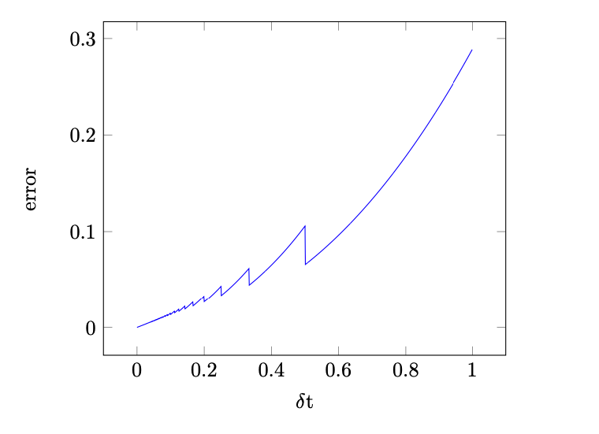
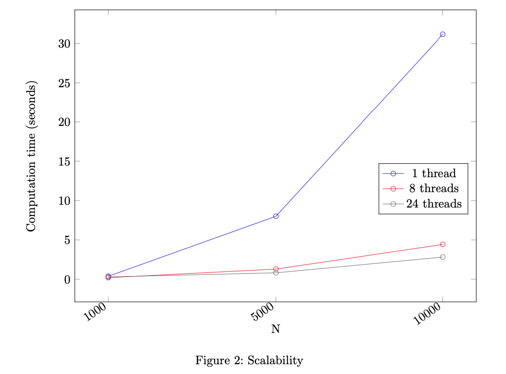

  <h1 align="center">N-Body Simulator</h1>
  <h3 align="center">COMP3671 Parallel Scientific Computing I Assignment 2022/2023</h3>
  

    <a href="https://github.com/pjborowiecki/COMP3577-Parallel-Scientific-Computing-I.git/issues">Report Bug</a>
    ·
    <a href="https://github.com/pjborowiecki/COMP3577-Parallel-Scientific-Computing-I.git/issues">Request Feature</a>
  

<!-- TABLE OF CONTENTS -->

  
Table of Contents

  <ol>
    <li>
      <a href="#about-the-project">About The Project</a>
      <ul>
        <li><a href="#step-1">Step 1</a></li>
        <li><a href="#step-2">Step 2</a></li>
        <li><a href="#step-3">Step 3</a></li>
        <li><a href="#step-4">Step 4</a></li>
      </ul>
    </li>
    <li>
    <a href="#feedback-received">Feedback Received</a>
    </li>
    <li><a href="#contributing">Contributing</a></li>
    <li><a href="#license">License</a></li>
    <li><a href="#contact">Contact</a></li>
  </ol>

<!-- ABOUT THE PROJECT -->

## About The Project

<!--  -->

This repository contains my final submission for the **COMP3671 Parallel Scientific Computing I** module assignment at Durham University in the academic year 2022/2023. The project focuses on solving 4 problems related to the N-Body simulation.

### Step 1

In step 1, an n-body simulator was implemented using the naive approach of directly calculating interactions between all pairs of bodies. As a time-stepping scheme, the Velocity Störmer Verlet Method method was used, which is of second order.

Accuracy of the time-stepping method was verified experimentally by considering a system of two bodies, A and B, orbiting the center of mass. Initial positions, velocities and masses were set to:
 

$$
x_A=(1,0,0), v_A=(0,0.5,0), m_A=1.0
$$

$$
x_B=(-1,0,0), v_B=(0,-0.5,0), m_B=1.0
$$  

In such a system, body A satisfies $x_A(t)=\left(\cos \left(\frac{t}{2}\right), \sin \left(\frac{t}{2}\right), 0\right)$, and this was compared to the outcome of the simulation at time $t=1$ as the time-step $\delta t$ varied. The error was calculated as the distance between predicted position and the outcome of the simulation, and plotted against $\delta t$ as shown in the figure below. The resulting plot is quadratic, as expected.

Since at every step all the interactions are directly calculated, the algorithm used has order of complexity $O\left(N^2\right)$. This could be reduced to $O(N \log N)$ or even $O(N)$ for the Fast Multipole Method. However, although the asymptotic complexity of these two methods is superior, there is an overhead of constructing an octree at every step, which could offset any potential time savings for small enough $N$.

A fixed time-step can lead to some collisions going ”unnoticed” as these are checked with no interpolation. This can be mitigated by adjusting time-step, so that the leaps at each step are bounded and the proximity condition for collision can be reliably checked at each step. By bounding the time-step from above, we can ensure that the convergence order remains the same, but the computation times become unpredictable.

### Step 2

In this section the cell-list algorithm was used to achieve order of complexity $O(N)$. The 3D-space is partitioned into cells of side length equal to twice the cut-off radius, and each cell contains the list of particles within it bounds, which is maintained on-the-fly throughout the simulation. Each particle interacts only with particles inside the same or neighbouring cells.

The grid of cells is represented by an STL container `std::unordered_map`, which allows for memory-efficient storage of cells with average look-up times of order $O(1)$, and the cells themselves are represented by `std::unordered_set`. Using these containers allows for, on the one hand, unbounded simulation box and on the other, keeping in memory only the cells which are currently occupied by particles. Therefore they are good, both for fast-moving, and for vibrating particles.

### Step 3

Both ***gcc*** and ***icpc*** successfully vectorise the inner loop in the most computationally expensive step of calculating gravitational forces between pairs of particles, resulting in significant performance gains. For example, computation time for a simulation with parameters $t_{e n d}=10, \delta t=0.1$ for $N = 10,000$ bodies decreased from $43$ to $10.9$ seconds (on an AMD EPYC 7B12 using avx2 instruction set), an impressive, almost $400\%$ performance boost.

### Step 4

The vectorised code from previous step was parallelised using OpenMP’s ***#pragma*** clauses. Due to data race issues the symmetry of gravitational force is no longer exploited, which doubles the number of interaction to compute at each step. This can be mitigated by, for example, having each thread work on its own, local copy of an array for storing contributions to acceleration of each particle, and then accumulating this data into the global array at the end, but this would require extra memory to store $3N×$ (the number of threads) numbers, which could become problematic for large, massively parallel simulations.

Since I never succeeded logging in to Hamilton, the scalability tests were performed using resources provided by Intel Developer Cloud, namely a dual 6-core Intel Xeon Gold 6128 CPU, giving 24 threads (2 threads per core) in total. As evidenced by the results, OpenMP does an excellent job parallelising the code with very little effort from the programmer. Tests were performed using parameter $t_{\text {end }}=1.0, \delta t=0.01$ with $N$ ranging from $1,000$ to $10,000$, with particles being randomly, uniformly distributed in a unit cube centered at the origin, each of mass $1$. The results are shown below:

 
<!-- FEEDBACK RECEIVED -->

## Feedback received

* **Step 1.1 feedback:** The implementation calculates forces correctly. The implementation is not very fast in spite of exploiting symmetry in the force calculation and improving data structures. In many cases this is due to unnecessary calculations being made. Also note that in fast code you should avoid branching. No estimate of stable timestep. Particles merge on collision.
 

* **Step 1.2 feedback:** Very nice write-up that fully covers almost all questions. The only missing component is the expected convergence order. So while behaviour of the method in regards to delta t is shown and plotted, a discussion of the slope is missing.
 

* **Step 2.1 feedback:** The code runs and gives an acceptable speed. The described data structures are implemented and thought through. There is an error in the force calculation. The cut-off radius chosen is reasonable although the reasoning for it is unclear.
 

* **Step 2.2 feedback:** The explanation of used data structures could have been more detailed. The cut-off radius is not discussed. The discussion of changes for different particle movement patterns is missing.
 

* **Step 3 feedback:** The output of the code is the same as in step 1, and <u>looking at the code shows an outstanding implementation. The use of memory-aligned one-dimensional arrays allows for perfect vectorisation, and an excellent speedup is achieved.</u>
 

* **Step 4 feedback:** The output of the code is the same as in steps 1 and 3, but the output does not change with the number of threads. Use of pragmas suggests good understanding of the OpenMP parallelisation model. Vectorisation is retained throughout. In the report, description of the environment is good. The plot is not suitable for a strong scaling model (which plots speedup versus number of threads) and the results are not compared with a strong scaling model (assessment of the fraction of code that must run serially).
 

- Step 1.1 marks: **11/18**
- Step 1.2 marks: **5/7**
- Step 2.1 marks: **12/20**
- Step 2.2 marks: **2/5**
- Step 3 marks: **20/20**
- Step 4 marks: **25/30**
 

- **Final grade: 75/100**

 
<!-- CONTRIBUTING -->

## Contributing

Contributions are what make the open source community such an amazing place to learn, inspire, and create. Any contributions you make are **greatly appreciated**.

If you have a suggestion that would make this better, please fork the repo and create a pull request. You can also simply open an issue with the tag "enhancement".
Don't forget to give the project a star! Thanks again!

1. Fork the Project
2. Create your Feature Branch (`git checkout -b feature/AmazingFeature`)
3. Commit your Changes (`git commit -m 'Add some AmazingFeature'`)
4. Push to the Branch (`git push origin feature/AmazingFeature`)
5. Open a Pull Request

(<a href="#readme-top">back to top</a>)

<!-- LICENSE -->

## License

Distributed under the MIT License.

(<a href="#readme-top">back to top</a>)

<!-- CONTACT -->

## Contact

Piotr Borowiecki - [@pjborowiecki](https://www.linkedin.com/in/pjborowiecki/) - hello@pjborowiecki.com

(<a href="#readme-top">back to top</a>)

$$
